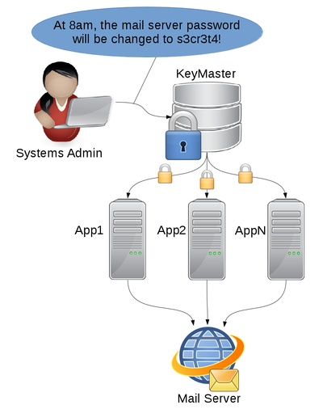

**Disclaimer**

This is a project I completed over the course of a weekend, with the goal of learning Go. Since it is the first thing I've written in Go, it most likely doesn't represent many best practices. Since I completed it over the course of just a few days, I wouldn't suggest sticking it in production out-of-the-box.

KeyMaster
=========

KeyMaster is a server and client-side API for storing and distributing secrets. The idea is for KeyMaster to act as a secured, central repository for secrets like service passwords.



KeyMaster has a number of features, each of which aim to achieve different goals.

* Reduction of client-side secrets. Beyond the client-side TLS certificate used for communication with the KeyMaster server, no secrets need to be stored on the client. This removes the need for configuration files filled with deployment passwords.
* Secrets always have a valid-from date, so secrets can be distributed in advance of a switch-over date.
* Mutual authentication. Both client and server use TLS certificates. KeyMaster uses pinned signatures and doesn't rely on any PKI.
* Client-side asymmetric encryption. The KeyMaster server never receives the plaintext secrets and therefore cannot be compromised to reveal stored secrets.
 * When a secret is added, the client which is adding the secret receives all the public keys of relevant clients, encrypts the secret with those keys, and then the ciphertext is stored on the KeyMaster server.
 * Although a compromised KeyMaster server would be able to hijack new secrets by inserting its own public key, it will not have access to any prior secrets.
* Continuous, automated certificate rotation. Both clients and the server rotate their certificates on a configurable interval.
 * Although not perfect (a compromised key can be used to authenticate additional key rotations), this provides some reduction of impact of a compromised key. In particular, already expired keys will generally be useless.
 * Clients need a valid certificate at deployment, but the KeyMaster client will automatically rotate certificates thereafter.
* Client-side caching. Although KeyMaster may become a single point of failure for dependent applications, clients cache secrets and only refer to the KeyMaster server to rotate certificates and check for updates. Downtime of the KeyMaster server will generally not impact applications.

Example Usage
-------------

```
func main() {
    client, err := client.Init("localhost", 12345, "applejack.crt", "applejack.pem",
        []string{"root_database_password"})
    if err != nil {
        log.Fatalf("Could not create client: %s", err)
    }
    // Optionally, you can change the key rotation durations
    client.ClientCertLifetime = 2 * time.Minute
    client.ClientRotatePeriod = 2 * time.Minute
    client.PollInterval = 1 * time.Minute
    // You can also manually trigger polling; useful for testing
    client.Poll()

    // This loop just prints out the current password
    for {
        log.Printf("root_database_password: %s", client.GetSecret("root_database_password"))
        time.Sleep(10 * time.Second)
    }
}
```

KeyMaster has a command line interface for some operations. You can add/change a secret with a command such as

    bin/keymaster addSecret client.crt client.pem root_database_password new_secret_value `date -u +%Y-%m-%dT%H:%M:%SZ` '2100-01-01T00:00:00Z'

